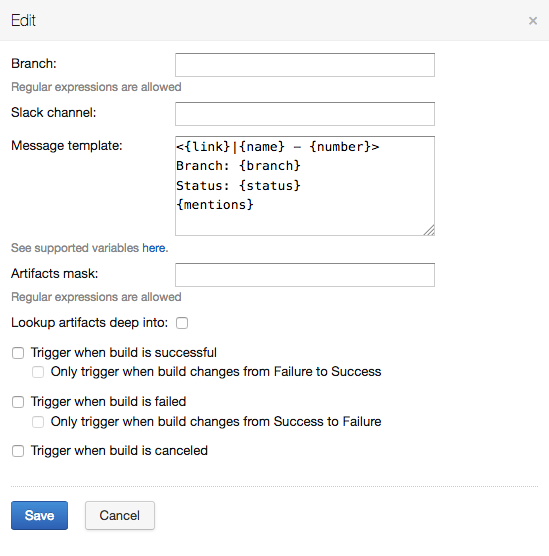

# TeamCity Slack plugin

[](https://travis-ci.org/alexkvak/teamcity-slack)

This plugin allows you to integrate your CI with Slack.

The main feature is that you can specify not exact branch name but the [regexp branch mask](#build-configuration).

For example, if you have separate build configurations for feature branches and common branches, then it is easy to
setup notifications into corresponding Slack channels.

The second big thing is that you can compose your own messages using [template placeholders](#message-placeholders) and [Slack formatting](https://api.slack.com/docs/message-formatting).

And you can easily send notifications without running the build with the *Try it* feature.

The plugin automatically backs up its settings after each modification.


## Table of Contents
1. [Install plugin](#install-plugin)
2. [Build configuration](#build-configuration)
3. [Message placeholders](#message-placeholders)
4. [Artifact links](#artifact-links)
5. [Message preview](#message-preview)
6. [Troubleshooting](#troubleshooting)

## Install plugin <a name="install-plugin"></a>
Download from [releases](https://github.com/alexkvak/teamcity-slack/releases) or compile 
sources with `mvn package`. 

Next upload `target/slackIntegration.zip` to TeamCity `data/plugins/` folder (restart is needed).

Go to [api.slack.com](https://api.slack.com/)
* Create new app.
* Go to Features - Incoming Webhooks and Activate Incoming Webhooks
* Go to Bot Users - Add Bot User
* Go to **OAuth & Permissions** and click **Install App in Workspace**
* Now copy **Bot User OAuth Access Token**.

Paste this token into **Administration -> Slack -> OAuth Access Token** field.


That's it! Now you can open any build configuration home and choose **Slack** tab.

By default personal notifications (private notifications) are disabled. 
Personal notifications notify only about failed builds.

**Slack** tab in classic UI:


**Slack** tab in experimental UI:

Only admins and projects admins have rights to access these settings. 

## Build configuration <a name="build-configuration"></a>

Sample configuration:



Notifications for branches captured by regular expression will be sent to slack channel or/and private chat.
Message will be compiled according to template.

**Note:** Please avoid using heading `#` in channel name. The proper relation between the user of the code repository and the slack user is established by the e-Mail address. This requires the same e-Mail address for both accounts. Otherwise the private message and the `{mentions}` placeholder for messages can't work properly 

The *Only trigger when build changes* option allows you to be notified when the previous build status changes from failure to success, or vice versa.
The previous build is the latest build on the same branch as the current build (or not if the current build has no branch), and
its status is determined (failure or success) and it's not a personal build.

The build settings number is not limited, so you can set up notifications for feature branches 
in one channel, and for release branches in another one.

## Message placeholders <a name="message-placeholders"></a>

###### {name} 
Full name of the build configuration, has the format "project_name :: buildconfig_name".

###### {number}
User defined build number.

###### {branch}
Branch display name, i.e. name to show to the user. *Unknown* if not applicable.

Please make sure that your VCS settings are correct!

See [TeamCity Docs](https://confluence.jetbrains.com/x/iwt2B#WorkingwithFeatureBranches-Logicalbranchname) and [#21](https://github.com/alexkvak/teamcity-slack/issues/21)

###### {status}
*succeeded* if build is successful, *started* if started, *canceled* if canceled, *failed* otherwise.

###### {link}
URL to view results page.

###### {mentions}
Slack users mentions only if build fails. Unknown users will be skipped.

###### {users}
TeamCity user name list only if build fails. Unknown users will be skipped.

###### {changes}
Concatenated description of head 5 changes from build with author name (from VCS) 
in square braces, e.g. *My awesome feature [John Smith]*.

###### {reason}
Build problems that caused build failure when build is failed. *Unknown* if cannot detect.

###### {artifactLinks}
See [Artifact links](#artifact-links).

###### {allArtifactsDownloadUrl}
Link to download all artifacts as zip archive.

###### {artifactsRelUrl}
Artifacts relative path. It is necessary if you want to construct artifact link manually.

###### Parameters placeholders
You can also use project and build parameters, e.g. **


## Artifact links <a name="artifact-links"></a>
In case you want to access build artifacts with third party web server (e.g. nginx) you can use this feature.
Specify *Public artifacts URL* as root path served by your web server. 
And *Artifacts mask* in [Build configuration](#build-configuration).
All other will be done automatically.

Sample nginx configuration:
```
location /art/ {
    alias <teamcity-data-dir>/system/artifacts/;
    autoindex on;
}
```

## Message preview <a name="message-preview"></a>
By default Slack plugin sends messages as attachments. 
But there is one inconvenience — there is no message preview in push notifications. 
It can be easily fixed by turning off the *Send message as attachment* checkbox in [Plugin setup](#install-plugin).

Now Slack messages look like


The message is prepended by Emoji ✅, ⛔ or ⚪ for successful, failed and other build statuses respectively.


## Troubleshooting <a name="troubleshooting"></a>
**Q:** I followed all the instructions, but I get error message `not_allowed_token_type` when I try to save my Bot token into TeamCity!

**A:** This plugin does not yet support the new Slack detailed OAuth scopes. When trying to save or use a token created for a Bot User using the new scopes, the Slack API will return that error message. When creating a new Slack App for this integration, do NOT opt into using the updated/beta scopes. If you have already opted in, you will need to create a new Slack App - there is no way to downgrade at this time. The only supported scope is the classic `bot` scope. 


